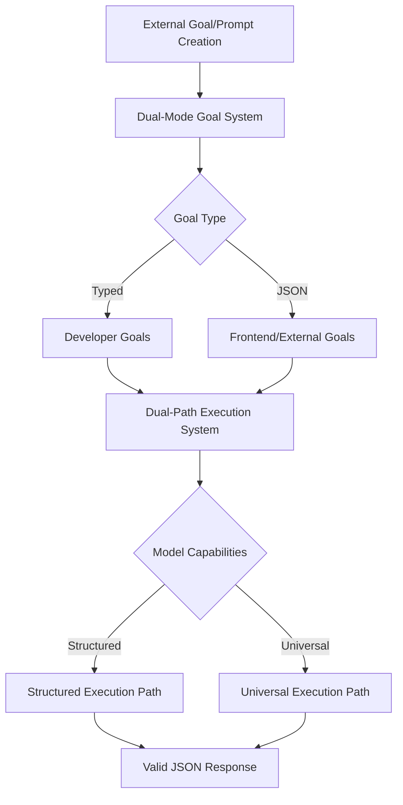

# LLMango Dual Systems Architecture Overview

## Overview

This document provides an overview of LLMango's two distinct "dual" systems. For detailed documentation, see the specific architecture documents.

**⚠️ IMPORTANT**: This document is deprecated. Please refer to the specific system documentation:
- **Goal Creation**: See `DUAL_MODE_GOAL_SYSTEM.md`
- **LLM Execution**: See `DUAL_PATH_EXECUTION_SYSTEM.md`

## Two Distinct Dual Systems

### 1. Dual-Mode Goal System ✅ (COMPLETED)
**Purpose**: Enable goal creation using either Go structs OR JSON
- **Typed Goals** (Developer Mode): Using Go structs for compile-time safety
- **JSON Goals** (Frontend Mode): Using pure JSON for runtime flexibility
- **Documentation**: `DUAL_MODE_GOAL_SYSTEM.md`
- **Status**: Fully implemented and tested

### 2. Dual-Path Execution System 🚧 (TO BE IMPLEMENTED)
**Purpose**: Enable LLM execution with either structured output OR universal prompts
- **Structured Execution Path**: For LLMs that support native JSON schema
- **Universal Execution Path**: For LLMs that don't support structured output
- **Documentation**: `DUAL_PATH_EXECUTION_SYSTEM.md`
- **Status**: Architecture planned, implementation needed

## Clear Naming Conventions

To avoid confusion, we use distinct terminology:

| System | Mode 1 | Mode 2 | Purpose |
|--------|--------|--------|---------|
| **Goal System** | Typed Goals | JSON Goals | Goal creation method |
| **Execution System** | Structured Path | Universal Path | LLM execution strategy |

## Current Focus

We are currently focused on implementing the **Dual-Path Execution System** to enable:
- External goals and prompts to work with any LLM
- Support for both structured-output-capable and non-structured LLMs
- Universal JSON response validation

## Architecture Integration



## Next Steps

1. **Implement Model Capability Detection** - Create whitelist of structured-output-capable models
2. **Build Universal Execution Path** - Integrate existing universal prompts system
3. **Create Execution Router** - Automatically choose optimal path based on model
4. **Integration Testing** - Ensure both systems work together seamlessly

## Architectural Inspiration

This dual-mode approach is inspired by several well-established frameworks:

### GraphQL Schema System
- **Typed Schema Definitions**: GraphQL supports both strongly-typed schema definitions (SDL) and dynamic schema introspection
- **Runtime Flexibility**: Clients can query schema information dynamically while maintaining type safety during development
- **Universal Compatibility**: Any GraphQL client can work with any GraphQL server regardless of implementation language

### Protocol Buffers (protobuf)
- **Compiled vs Dynamic**: Supports both compiled `.proto` definitions for performance and dynamic message parsing using descriptors
- **Schema Evolution**: Allows schema changes while maintaining backwards compatibility
- **Language Agnostic**: Generated code works across multiple programming languages

### gRPC Dual Interface
- **Compiled Types**: Strongly-typed interfaces for performance-critical applications
- **Dynamic Clients**: Generic clients that can work with any gRPC service using reflection
- **Universal Compatibility**: Both approaches can interact with the same underlying service

## Problem Statement

The original LLMango goal system used strongly-typed generics:

```go
type Goal struct {
    InputOutput any `json:"inputOutput"` // InputOutput[ConcreteType, ConcreteType]
}

type InputOutput[input any, output any] struct {
    InputExample    input             `json:"inputExample"`
    InputValidator  func(input) bool  `json:"-"`
    OutputExample   output            `json:"outputExample"`
    OutputValidator func(output) bool `json:"-"`
}
```

**Limitations:**
1. **Not Serializable**: Validator functions cannot be serialized to JSON
2. **Limited LLM Support**: Only works with LLMs that support native structured outputs
3. **Frontend Complexity**: Frontend cannot easily create goals without Go type definitions
4. **Runtime Inflexibility**: Cannot create goals dynamically from user input

## Solution: Dual-Mode Architecture

### Core Concept

The dual-mode system supports two goal creation patterns:

1. **Developer Mode**: `InputOutput[ConcreteType, ConcreteType]` for compile-time safety
2. **Frontend/Dynamic Mode**: `InputOutput[json.RawMessage, json.RawMessage]` for runtime flexibility

### Type Detection System

```go
func isJSONRawMessageInputOutput(inputOutput any) bool {
    // Uses reflection to detect InputOutput[json.RawMessage, json.RawMessage]
    typeName := reflect.TypeOf(inputOutput).Name()
    return strings.HasPrefix(typeName, "InputOutput[") && 
           bothFieldsAreJSONRawMessage(inputOutput)
}
```

**Key Insight**: Generic types in Go include full type parameters in their name:
- Typed: `InputOutput[mypackage.MyInput,mypackage.MyOutput]`
- JSON: `InputOutput[encoding/json.RawMessage,encoding/json.RawMessage]`

### Schema Generation Pipeline

```go
// From JSON examples, generate schemas for validation and LLM structured output
func GenerateSchemaFromJSONExample(example json.RawMessage) (*Definition, error) {
    var parsed interface{}
    json.Unmarshal(example, &parsed)
    return generateSchemaFromInterface(parsed)
}
```

**Benefits:**
- **Automatic Schema Inference**: No manual schema writing required
- **LLM Context**: JSON examples provide clear context for LLMs
- **Validation**: Generated schemas enable runtime validation
- **Universal Compatibility**: Works with any LLM, not just those with structured output support

### Execution Engine

```go
func (m *LLMangoManager) ExecuteGoal(goalUID string, input json.RawMessage) (json.RawMessage, error) {
    goal := m.Goals.Get(goalUID)
    
    if isJSONRawMessageInputOutput(goal.InputOutput) {
        return m.executeJSONGoal(goal, input)  // Dynamic schema-based execution
    } else {
        return m.executeTypedGoal(goal, input) // Existing typed execution
    }
}
```

## Implementation Details

### Phase 1: Type Detection
- Reflection-based detection of `InputOutput[json.RawMessage, json.RawMessage]`
- Safe extraction of JSON examples from goal structures
- Backwards compatibility with existing typed goals

### Phase 2: Schema Generation
- Recursive JSON schema generation from examples
- Support for nested objects, arrays, and primitive types
- Automatic type inference (string, number, integer, boolean, null)

### Phase 3: Validation System
- Runtime JSON validation against generated schemas
- Detailed error messages with field paths
- Support for required fields and additional properties control

### Phase 4: Factory Functions
```go
// For developers (compile-time safety)
func NewTypedGoal[I, O any](uid, title, description string, inputExample I, outputExample O) *Goal

// For frontend/dynamic use (runtime flexibility)
func NewJSONGoal(uid, title, description string, inputExample, outputExample json.RawMessage) *Goal

// Migration utility
func ConvertTypedGoalToJSON(typedGoal *Goal) (*Goal, error)
```

## Universal LLM Support Strategy

### Current Limitation
Many LLMs don't support OpenAI's structured output format. The original system only worked with compatible models.

### Dual-Mode Solution

1. **Schema-Compatible LLMs**: Use generated schemas with native structured output
2. **Non-Compatible LLMs**: Use existing JSON parsing with schema validation
3. **Fallback Strategy**: Always validate output against schema regardless of LLM capabilities

```go
func (m *LLMangoManager) executeWithUniversalSupport(goal *Goal, input json.RawMessage) (json.RawMessage, error) {
    if m.supportsStructuredOutput() {
        return m.executeWithStructuredOutput(goal, input)
    } else {
        return m.executeWithJSONParsing(goal, input)
    }
}
```

## Benefits

### For Developers
- **Backwards Compatibility**: Existing typed goals continue to work unchanged
- **Type Safety**: Compile-time checking for typed goals
- **Migration Path**: Easy conversion from typed to JSON goals

### For Frontend/Dynamic Use
- **No Go Dependencies**: Create goals using pure JSON
- **Runtime Flexibility**: Generate goals from user input
- **Universal Compatibility**: Works with any LLM

### For System Architecture
- **Serializable**: All goal data can be stored/transmitted as JSON
- **Extensible**: Easy to add new validation rules or schema features
- **Performant**: Minimal overhead for type detection and schema generation

## Testing Strategy

### Comprehensive Test Coverage
1. **Type Detection Tests**: Verify correct identification of JSON vs typed goals
2. **Schema Generation Tests**: Validate schema creation from various JSON structures
3. **Validation Tests**: Ensure proper validation of JSON against schemas
4. **Factory Function Tests**: Test goal creation in both modes
5. **Integration Tests**: End-to-end testing of dual-mode execution

### Test-Driven Development
- Core functions implemented with tests first
- Progressive building from basic type detection to full execution
- Validation of backwards compatibility with existing message parser tests

## Migration Guide

### For Existing Users
1. **No Action Required**: Existing typed goals continue to work
2. **Optional Migration**: Use `ConvertTypedGoalToJSON()` to convert goals
3. **New Goals**: Choose typed (developer) or JSON (frontend) based on use case

### For Frontend Integration
```typescript
// Frontend can now create goals directly
const goal = {
  UID: "user-goal-1",
  title: "User Created Goal",
  description: "Created from frontend",
  inputOutput: {
    inputExample: { "query": "example query" },
    outputExample: { "result": "example result", "confidence": 0.95 }
  }
}
```

## Future Enhancements

### Schema Description Support
- Add support for JSON schema `description` fields
- Provide LLMs with rich context about expected inputs/outputs
- Enable better goal understanding and execution

### Advanced Validation
- Custom validation rules beyond basic JSON schema
- Cross-field validation (e.g., conditional requirements)
- Performance optimizations for large schemas

### Tooling
- Schema visualization tools
- Goal migration utilities
- Development-time schema validation

## Conclusion

The dual-mode architecture successfully bridges the gap between developer productivity and runtime flexibility. By drawing inspiration from proven frameworks like GraphQL and Protocol Buffers, we've created a system that:

1. **Maintains Backwards Compatibility**: Existing code continues to work
2. **Enables Universal LLM Support**: Works with any LLM, not just structured-output compatible ones
3. **Provides Frontend Flexibility**: Pure JSON goal creation without Go dependencies
4. **Ensures Type Safety**: Developers can still use strongly-typed goals when appropriate

This architecture positions LLMango as a truly universal LLM orchestration platform that can adapt to any use case while maintaining the performance and safety benefits of strongly-typed systems where appropriate.