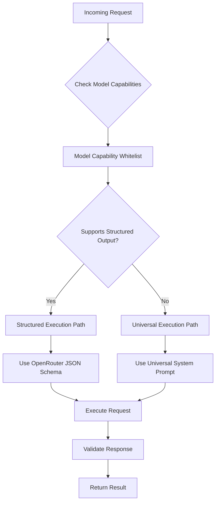
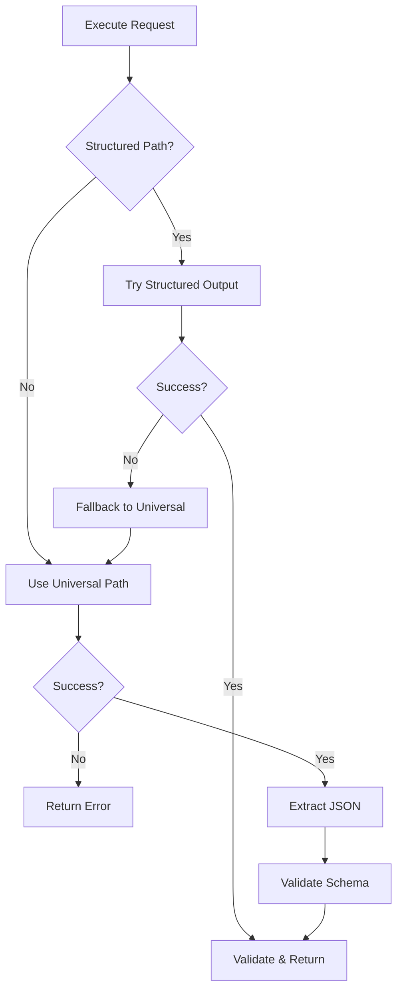

# Dual-Path Execution System Architecture

## Overview

This document describes LLMango's **Dual-Path Execution System**, which enables both structured-output-capable and non-structured LLMs to return valid JSON responses. This system automatically detects model capabilities and chooses the optimal execution path.

**Note**: This is separate from the "Dual-Mode Goal System" which handles goal creation using Go structs vs JSON.

## System Purpose

Enable LLM execution in two paths:
1. **Structured Execution Path**: For LLMs that support native JSON schema structured output
2. **Universal Execution Path**: For LLMs that don't support structured output, using universal prompts

## Problem Statement

Current LLMango execution system only works with LLMs that support OpenAI's structured output format:

```go
// Current system - only works with structured-output-capable LLMs
responseFormat, err := openrouter.UseOpenRouterJsonFormat(outputExample, goal.Title)
routerRequest.Parameters.ResponseFormat = responseFormat
```

**Limitations:**
1. **Limited LLM Support**: Only works with models that support structured output
2. **No Fallback**: Fails completely if model doesn't support structured output
3. **Vendor Lock-in**: Tied to specific LLM providers and capabilities
4. **External Goal Limitation**: External goals/prompts can't work with non-structured LLMs

## Solution: Dual-Path Execution

### Core Concept

Automatically detect model capabilities and route execution through the appropriate path:

1. **Structured Path**: Use native JSON schema for compatible models (faster, more reliable)
2. **Universal Path**: Use universal prompts + JSON extraction for all other models

### Architecture Flow



## Implementation Components

### 1. Model Capability Detection

```go
// openrouter/model_capabilities.go
type ModelCapabilities struct {
    SupportsStructuredOutput bool
    SupportsSystemPrompts    bool
    MaxContextLength        int
    Provider                string
}

var StructuredOutputModels = map[string]ModelCapabilities{
    "openai/gpt-4": {
        SupportsStructuredOutput: true,
        SupportsSystemPrompts: true,
        MaxContextLength: 128000,
        Provider: "openai",
    },
    "anthropic/claude-3-sonnet": {
        SupportsStructuredOutput: false, // Use universal path
        SupportsSystemPrompts: true,
        MaxContextLength: 200000,
        Provider: "anthropic",
    },
    // Default for unknown models
    "default": {
        SupportsStructuredOutput: false,
        SupportsSystemPrompts: true,
        MaxContextLength: 4096,
        Provider: "unknown",
    },
}

func GetModelCapabilities(modelID string) ModelCapabilities {
    if caps, exists := StructuredOutputModels[modelID]; exists {
        return caps
    }
    return StructuredOutputModels["default"]
}
```

### 2. Execution Path Router

```go
// llmango/execution_router.go
func (m *LLMangoManager) ExecuteGoalWithDualPath(goalUID string, input json.RawMessage) (json.RawMessage, error) {
    goal := m.Goals.Get(goalUID)
    selectedPrompt := m.selectPrompt(goal)
    
    capabilities := openrouter.GetModelCapabilities(selectedPrompt.Model)
    
    if capabilities.SupportsStructuredOutput {
        return m.executeWithStructuredOutput(goal, selectedPrompt, input)
    } else {
        return m.executeWithUniversalCompatibility(goal, selectedPrompt, input)
    }
}
```

### 3. Structured Execution Path (Enhanced Current System)

```go
func (m *LLMangoManager) executeWithStructuredOutput(goal *Goal, prompt *Prompt, input json.RawMessage) (json.RawMessage, error) {
    // Use existing logic from requests.go with enhancements
    routerRequest := &openrouter.OpenRouterRequest{
        Messages: updatedMessages,
        Model: &prompt.Model,
        Parameters: prompt.Parameters,
    }
    
    // Generate JSON schema for structured output
    responseFormat, err := openrouter.UseOpenRouterJsonFormat(outputExample, goal.Title)
    if err != nil {
        // Fallback to universal path if schema generation fails
        return m.executeWithUniversalCompatibility(goal, prompt, input)
    }
    
    routerRequest.Parameters.ResponseFormat = responseFormat
    return m.executeRequest(routerRequest)
}
```

### 4. Universal Execution Path (New Implementation)

```go
func (m *LLMangoManager) executeWithUniversalCompatibility(goal *Goal, prompt *Prompt, input json.RawMessage) (json.RawMessage, error) {
    // Generate schema for validation
    schema, err := openrouter.GenerateSchemaFromJSONExample(goal.OutputExample)
    if err != nil {
        return nil, fmt.Errorf("failed to generate schema: %w", err)
    }
    
    // Create universal system prompt using existing universal_prompts.go
    universalPrompt := openrouter.CreateUniversalCompatibilityPrompt(
        prompt.GetSystemMessage(), 
        schema.ToMap(), 
        goal.InputExample, 
        goal.OutputExample,
    )
    
    // Merge with existing system prompt using collision strategy
    updatedMessages := m.injectUniversalPrompt(prompt.Messages, universalPrompt)
    
    routerRequest := &openrouter.OpenRouterRequest{
        Messages: updatedMessages,
        Model: &prompt.Model,
        Parameters: prompt.Parameters,
        // No ResponseFormat - let LLM generate free-form response
    }
    
    response, err := m.executeRequest(routerRequest)
    if err != nil {
        return nil, err
    }
    
    // Extract and validate JSON from response using existing cleaner
    cleanedJSON := openrouter.PseudoStructuredResponseCleaner(string(response))
    if err := openrouter.ValidateJSONAgainstSchema(json.RawMessage(cleanedJSON), schema); err != nil {
        return nil, fmt.Errorf("response validation failed: %w", err)
    }
    
    return json.RawMessage(cleanedJSON), nil
}
```

### 5. Enhanced Error Handling & Fallback



## Integration with Existing System

### Backwards Compatibility

```go
// Modify existing Run functions to use dual path
func Run[I, R any](l *LLMangoManager, g *Goal, input *I) (*R, error) {
    inputJSON, err := json.Marshal(input)
    if err != nil {
        return nil, err
    }
    
    // Use new dual path execution (transparent to existing code)
    resultJSON, err := l.ExecuteGoalWithDualPath(g.UID, inputJSON)
    if err != nil {
        return nil, err
    }
    
    var result R
    if err := json.Unmarshal(resultJSON, &result); err != nil {
        return nil, err
    }
    
    return &result, nil
}
```

## Implementation Status

🚧 **TO BE IMPLEMENTED**

### Phase 1: Model Capability System
- [ ] Create model capability whitelist
- [ ] Implement capability detection logic
- [ ] Add tests for model classification

### Phase 2: Universal Execution Path
- [ ] Implement universal compatibility execution path
- [ ] Integrate with existing universal_prompts.go system
- [ ] Create system prompt injection logic

### Phase 3: Execution Router
- [ ] Create execution path router
- [ ] Implement fallback logic
- [ ] Add comprehensive error handling

### Phase 4: Integration & Testing
- [ ] Integrate with existing requests.go system
- [ ] Comprehensive testing of both paths
- [ ] Performance optimization

## Benefits

### Universal LLM Support
- **Any LLM Works**: Support for both structured and non-structured output models
- **Automatic Detection**: No manual configuration required
- **Future-Proof**: New models automatically supported via universal path

### Performance Optimization
- **Best Path Selection**: Use structured output when available (faster, more reliable)
- **Graceful Fallback**: Fall back to universal prompts when needed
- **Intelligent Routing**: Optimal execution based on model capabilities

### External Integration
- **External Goals**: Goals created externally work with any LLM
- **External Prompts**: Prompts created externally work with any LLM
- **API Compatibility**: Same API works regardless of underlying LLM

### Developer Experience
- **Transparent**: Existing code continues to work unchanged
- **Enhanced Reliability**: Multiple execution paths reduce failure points
- **Clear Error Messages**: Detailed feedback on execution path and failures

## Testing Strategy

### Comprehensive Test Coverage
1. **Model Capability Tests**: Verify correct model classification
2. **Execution Path Tests**: Test both structured and universal paths
3. **Fallback Tests**: Ensure proper fallback behavior
4. **Integration Tests**: End-to-end testing with various models
5. **Performance Tests**: Compare execution times and accuracy

### Test Models
- **Structured Output Models**: OpenAI GPT-4, GPT-3.5-turbo
- **Non-Structured Models**: Anthropic Claude, Llama models
- **Unknown Models**: Test default fallback behavior

## Conclusion

The Dual-Path Execution System enables LLMango to work with ANY LLM, regardless of structured output support. By automatically detecting model capabilities and choosing the optimal execution path, we provide:

1. **Universal Compatibility**: Works with any LLM
2. **Performance Optimization**: Uses best available execution method
3. **Reliability**: Multiple paths reduce failure points
4. **External Integration**: Enables external goals/prompts to work with any model

This system, combined with the Dual-Mode Goal System, positions LLMango as a truly universal LLM orchestration platform.