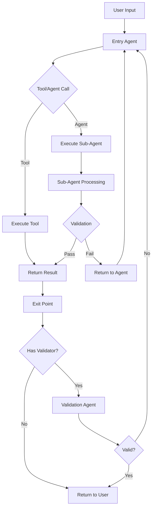
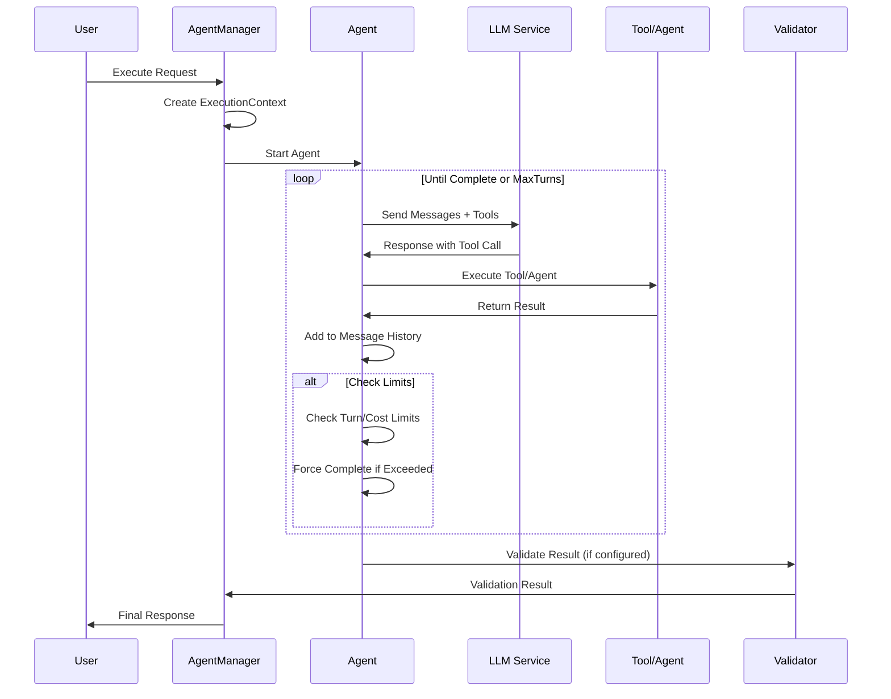
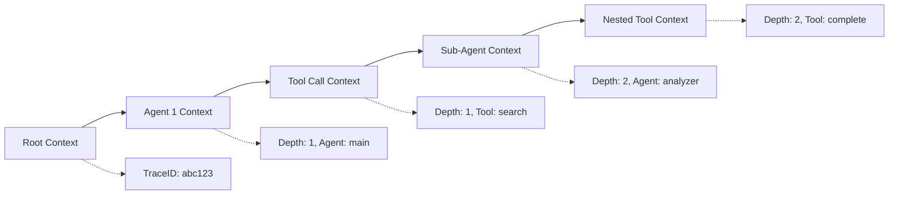

# LLMango Agentic Framework Design Plan

## Overview

We're building a simple yet powerful agentic framework where **agents are tools** and **tools are agents** - creating a unified, extensible system that leverages Go's context system for tracking and control.

## Core Design Principles

1. **Unified Tool/Agent Interface**: Agents implement the same `Tool` interface, making agent calls indistinguishable from tool calls
2. **Context-Driven Execution**: Use Go's `context.Context` for depth tracking, spend monitoring, and execution control
3. **Simple but Robust**: Minimal complexity with comprehensive logging and tracing
4. **Extensible Architecture**: Easy to add new tools/agents without changing core logic

## System Architecture



## Core Components

### 1. Enhanced Tool Interface

```go
type Tool interface {
    Run(ctx context.Context, input json.RawMessage) (json.RawMessage, error)
    GetSchema() (json.RawMessage, error)
    GetDescription() string
    GetName() string
}
```

**Key Changes from Current Interface:**
- Add `context.Context` parameter to `Run()` method
- This allows tools to access execution context (depth, spend, trace ID)
- Enables proper cancellation and timeout handling

### 2. Agent Structure (Enhanced)

```go
type Agent struct {
    Name          string
    SystemMessage string
    Model         string
    Parameters    openrouter.Parameters
    Tools         []Tool
    MaxTurns      int
    MaxCost       int // in millicents
}
```

**Key Features:**
- Agents implement the `Tool` interface
- Built-in limits for turns and cost
- Flexible tool assignment per agent

### 3. Execution Context

```go
type ExecutionContext struct {
    TraceID       string
    Depth         int
    TotalSpend    int
    AgentPath     []string
    StartTime     time.Time
    MaxDepth      int
    MaxSpend      int
}

// Context keys
type contextKey string
const (
    ExecutionContextKey contextKey = "execution_context"
)

// Helper functions
func WithExecutionContext(ctx context.Context, execCtx *ExecutionContext) context.Context
func GetExecutionContext(ctx context.Context) (*ExecutionContext, bool)
func IncrementDepth(ctx context.Context, agentName string) context.Context
func AddSpend(ctx context.Context, cost int) context.Context
```

**Key Features:**
- Tracks execution depth (distance from root)
- Monitors total spend across all agents
- Maintains agent execution path for logging
- Enforces configurable limits

### 4. Workflow Step

```go
type WorkflowStep struct {
    Agent           Agent
    MaxRuns         int
    MaxCost         int
    ValidationAgent *Agent                      // optional
    ValidationFunc  func(json.RawMessage) bool  // optional
    ExitCondition   func(json.RawMessage) bool  // optional
}
```

**Validation Options:**
- **Agent Validator**: Another agent validates the output
- **Function Validator**: Simple boolean validation
- **Exit Condition**: Custom logic to determine completion

### 5. Core Tools

#### CompleteTask Tool
```go
type CompleteTaskTool struct{}

func (c *CompleteTaskTool) Run(ctx context.Context, input json.RawMessage) (json.RawMessage, error) {
    // Marks the current agent's task as complete
    // Returns the input as the final result
    return input, nil
}

func (c *CompleteTaskTool) GetName() string { return "complete_task" }
func (c *CompleteTaskTool) GetDescription() string { 
    return "Mark the current task as complete and return the result" 
}
```

#### UseAgent Tool
```go
type UseAgentTool struct {
    AgentRegistry map[string]*Agent
    Manager       *LLMangoManager
}

func (u *UseAgentTool) Run(ctx context.Context, input json.RawMessage) (json.RawMessage, error) {
    // Parse input to get agent name and task
    // Execute the specified agent with the given input
    // Return the agent's result
}

func (u *UseAgentTool) GetName() string { return "use_agent" }
func (u *UseAgentTool) GetDescription() string { 
    return "Call another agent to handle a specific task" 
}
```

#### ReturnToUser Tool
```go
type ReturnToUserTool struct{}

func (r *ReturnToUserTool) Run(ctx context.Context, input json.RawMessage) (json.RawMessage, error) {
    // Immediately returns to the user with the provided input
    // Bypasses any remaining agent processing
    return input, nil
}

func (r *ReturnToUserTool) GetName() string { return "return_to_user" }
func (r *ReturnToUserTool) GetDescription() string { 
    return "Return immediately to the user with the current result" 
}
```

## Execution Flow

### 1. Agent Execution Loop



### 2. Context Propagation



### 3. Agent Execution Algorithm

```go
func (am *AgentManager) ExecuteAgent(ctx context.Context, agent *Agent, input json.RawMessage) (json.RawMessage, error) {
    // 1. Check context limits (depth, spend)
    execCtx, ok := GetExecutionContext(ctx)
    if !ok {
        return nil, errors.New("no execution context")
    }
    
    if execCtx.Depth > execCtx.MaxDepth {
        return am.forceComplete(agent, input, "max depth exceeded")
    }
    
    if execCtx.TotalSpend > execCtx.MaxSpend {
        return am.forceComplete(agent, input, "max spend exceeded")
    }
    
    // 2. Initialize conversation with system message
    messages := []openrouter.Message{
        {Role: "system", Content: agent.SystemMessage},
        {Role: "user", Content: string(input)},
    }
    
    // 3. Execute turns until completion or limits
    for turn := 0; turn < agent.MaxTurns; turn++ {
        // Make LLM call with tools
        response, err := am.llmManager.CallWithTools(ctx, agent.Model, messages, agent.Tools)
        if err != nil {
            return nil, err
        }
        
        // Process tool calls
        if response.HasToolCalls() {
            for _, toolCall := range response.ToolCalls {
                result, err := am.executeTool(ctx, agent.Tools, toolCall)
                if err != nil {
                    return nil, err
                }
                
                // Check for completion signals
                if am.isCompletionResult(result) {
                    return result, nil
                }
                
                // Add tool result to conversation
                messages = append(messages, openrouter.Message{
                    Role: "tool",
                    Content: string(result),
                    ToolCallID: toolCall.ID,
                })
            }
        } else {
            // No tool calls, agent is done
            return json.RawMessage(response.Content), nil
        }
        
        // Check limits after each turn
        if am.shouldForceComplete(ctx, turn, agent) {
            return am.forceComplete(agent, input, "limits exceeded")
        }
    }
    
    // Max turns reached
    return am.forceComplete(agent, input, "max turns exceeded")
}
```

## Implementation Plan

### Phase 1: Core Infrastructure (Day 1 Morning)
1. **Enhanced Tool Interface**: Update existing tool interface to include context
   - Modify `llmangoagents/agents.go`
   - Update existing tools to match new interface
2. **Execution Context**: Implement context structure and helper functions
   - Create `llmangoagents/execution_context.go`
3. **Agent Manager**: Create agent registry and execution manager
   - Create `llmangoagents/agent_manager.go`

### Phase 2: Core Tools (Day 1 Afternoon)
1. **CompleteTask Tool**: Implement task completion tool
   - Create `llmangoagents/complete_task_tool.go`
2. **UseAgent Tool**: Implement agent-calling tool
   - Create `llmangoagents/use_agent_tool.go`
3. **ReturnToUser Tool**: Implement user return tool
   - Create `llmangoagents/return_to_user_tool.go`

### Phase 3: Agent Execution Engine (Day 1 Evening)
1. **Agent Executor**: Main execution loop with turn limits and cost tracking
   - Implement in `agent_manager.go`
2. **Context Management**: Depth tracking, spend monitoring, trace ID generation
   - Enhance `execution_context.go`
3. **Error Handling**: Graceful failures, forced completion on limits
4. **Basic Logging**: Integration with existing llmangologger

### Phase 4: Validation System (Day 2 Morning)
1. **Validation Interface**: Support for both agent and function validators
   - Create `llmangoagents/validation.go`
2. **Validation Chain**: Automatic retry logic for failed validations
3. **Exit Point Logic**: Configurable exit conditions and validators

### Phase 5: Integration & Testing (Day 2 Afternoon)
1. **LLMangoManager Integration**: Connect with existing goal/prompt system
   - Update `llmango/llmango.go`
2. **Frontend Integration**: API endpoints for agent management
   - Update `llmangofrontend/`
3. **Comprehensive Testing**: Unit tests and integration tests
4. **Documentation**: Usage examples and API documentation

## Key Features

### 1. Depth Control
- Track distance from root agent using context
- Configurable max depth limits per execution
- Automatic forced completion when limits reached
- Clear logging of agent call hierarchy

### 2. Cost Management
- Real-time spend tracking using OpenRouter pricing
- Per-agent and total workflow cost limits
- Cost-based early termination
- Detailed cost breakdown in logs

### 3. Comprehensive Logging
```go
type AgentLogEntry struct {
    TraceID     string          `json:"traceId"`
    Depth       int             `json:"depth"`
    AgentName   string          `json:"agentName"`
    Turn        int             `json:"turn"`
    Action      string          `json:"action"` // "tool_call", "llm_response", "validation", etc.
    Cost        int             `json:"cost"`
    Timestamp   time.Time       `json:"timestamp"`
    Data        json.RawMessage `json:"data"`
    ParentTrace string          `json:"parentTrace,omitempty"`
}
```

**Log Actions:**
- `agent_start`: Agent begins execution
- `llm_call`: LLM API call made
- `tool_call`: Tool executed
- `agent_call`: Sub-agent called
- `validation`: Result validation
- `forced_complete`: Limits exceeded, forced completion
- `agent_complete`: Agent finished successfully

### 4. Flexible Validation
- **Agent Validators**: Use another agent to validate results
  ```go
  validator := &Agent{
      Name: "result_validator",
      SystemMessage: "Validate if the result meets the requirements...",
      Tools: []Tool{&CompleteTaskTool{}},
  }
  ```
- **Function Validators**: Simple boolean validation functions
  ```go
  validationFunc := func(result json.RawMessage) bool {
      // Custom validation logic
      return true
  }
  ```
- **Schema Validators**: JSON schema validation using existing openrouter functionality
- **Manual Validators**: Human-in-the-loop validation (future enhancement)

## Example Usage

### Basic Agent Setup
```go
// Create agent registry
registry := make(map[string]*Agent)

// Create specialized agents
searchAgent := &Agent{
    Name: "search_specialist",
    SystemMessage: "You specialize in web searches and data retrieval. Use the search tool to find information, then complete the task with your findings.",
    Model: "openai/gpt-4o-mini",
    Tools: []Tool{
        &BingSearchTool{},
        &CompleteTaskTool{},
    },
    MaxTurns: 5,
    MaxCost: 500, // 5 cents
}
registry["search_specialist"] = searchAgent

analysisAgent := &Agent{
    Name: "data_analyst",
    SystemMessage: "You analyze data and provide insights. Process the provided data and complete the task with your analysis.",
    Model: "anthropic/claude-sonnet-4",
    Tools: []Tool{
        &CompleteTaskTool{},
    },
    MaxTurns: 3,
    MaxCost: 1000, // 10 cents
}
registry["data_analyst"] = analysisAgent

// Create main orchestrator agent
mainAgent := &Agent{
    Name: "main_assistant",
    SystemMessage: "You are a helpful assistant that can search for information and analyze data. Use the search_specialist for finding information and data_analyst for analysis. Always complete your task when done.",
    Model: "anthropic/claude-sonnet-4",
    Tools: []Tool{
        &UseAgentTool{AgentRegistry: registry},
        &CompleteTaskTool{},
        &ReturnToUserTool{},
    },
    MaxTurns: 10,
    MaxCost: 2000, // 20 cents
}
```

### Execution Example
```go
// Create agent manager
agentManager := &AgentManager{
    LLMManager: llmangoManager,
    Logger:     logger,
}

// Create execution context
ctx := context.Background()
execCtx := &ExecutionContext{
    TraceID:    generateTraceID(),
    Depth:      0,
    TotalSpend: 0,
    AgentPath:  []string{},
    StartTime:  time.Now(),
    MaxDepth:   5,
    MaxSpend:   5000, // 50 cents total
}
ctx = WithExecutionContext(ctx, execCtx)

// Execute workflow
userInput := json.RawMessage(`{"query": "Find information about Go programming best practices and analyze the key recommendations"}`)
result, err := agentManager.ExecuteAgent(ctx, mainAgent, userInput)
if err != nil {
    log.Printf("Execution failed: %v", err)
    return
}

log.Printf("Final result: %s", string(result))
```

### Expected Execution Flow
1. **Main Agent** receives user query
2. **Main Agent** calls `use_agent` tool with `search_specialist`
3. **Search Specialist** uses `BingSearchTool` to find information
4. **Search Specialist** calls `complete_task` with search results
5. **Main Agent** receives search results
6. **Main Agent** calls `use_agent` tool with `data_analyst`
7. **Data Analyst** analyzes the search results
8. **Data Analyst** calls `complete_task` with analysis
9. **Main Agent** receives analysis
10. **Main Agent** calls `complete_task` with final response

## Benefits

1. **Simplicity**: Unified tool/agent interface reduces complexity
2. **Extensibility**: Easy to add new capabilities as tools
3. **Control**: Built-in limits prevent runaway execution
4. **Observability**: Comprehensive logging and tracing with trace IDs
5. **Flexibility**: Multiple validation strategies
6. **Integration**: Seamless integration with existing LLMango infrastructure
7. **Performance**: Efficient context propagation using Go's built-in context system
8. **Debugging**: Clear execution paths and detailed logging for troubleshooting

## File Structure

```
llmangoagents/
├── AGENTIC_FRAMEWORK_DESIGN.md     # This design document
├── agents.go                       # Enhanced Agent and Tool interfaces
├── agent_manager.go                # Core execution engine
├── execution_context.go            # Context management
├── complete_task_tool.go           # Task completion tool
├── use_agent_tool.go              # Agent calling tool
├── return_to_user_tool.go         # User return tool
├── validation.go                   # Validation system
├── logging.go                      # Agent-specific logging
├── examples/
│   ├── basic_agent_example.go     # Simple usage example
│   ├── multi_agent_workflow.go    # Complex workflow example
│   └── validation_example.go      # Validation usage example
└── tests/
    ├── agent_manager_test.go       # Core functionality tests
    ├── execution_context_test.go   # Context management tests
    └── integration_test.go         # End-to-end tests
```

This design provides a solid foundation for building complex agentic workflows while maintaining simplicity and leveraging Go's excellent concurrency and context management features. The unified tool/agent interface makes the system highly extensible, while the context-driven execution provides robust control and observability.